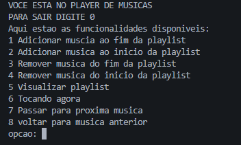
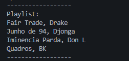

# Playlist em C

Este projeto é um player de músicas simples implementado em C, utilizando lista duplamente ligada circular para gerenciar uma playlist. O usuário pode adicionar, remover, visualizar e navegar entre músicas.

## Funcionalidades

- Adicionar música ao início ou fim da playlist
- Remover música do início ou fim da playlist
- Visualizar todas as músicas da playlist
- Ver qual música está tocando
- Passar para a próxima música
- Voltar para a música anterior

## Demonstração

### Menu



### Visualizando a playlist



### Tocando uma música


### Tocando próxima música


### Tocando música anterior a primeira


## Como compilar e executar

1. Certifique-se de ter o [MinGW](http://mingw.org/) instalado no Windows.
2. No terminal, navegue até a pasta do projeto.
3. Compile usando o comando:
```
mingw32-make

ou

make
```
4. Execute o programa:
```
Playlist.exe
```

## Estrutura do Projeto
```
Playlist/
├── include/
│ └── playlist.h
├── src/
│ ├── main.c
│ └── playlist.c
├── Makefile
```